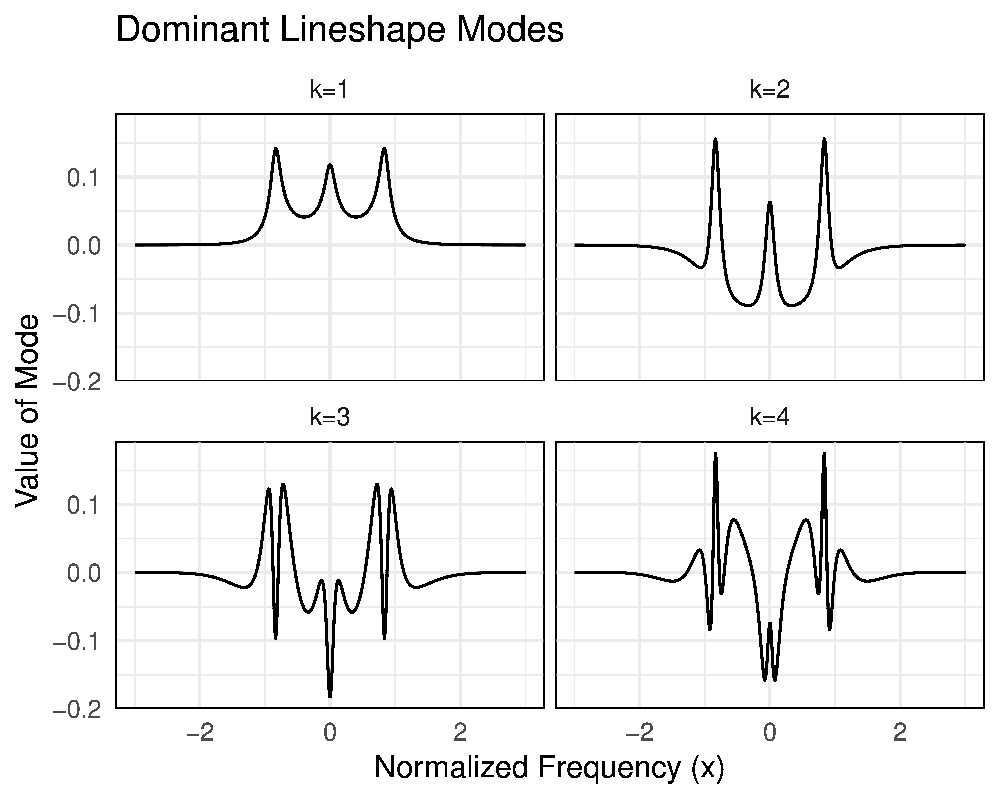

# svsa: Support Vector Spectrum Approximator

The Support Vector Spectrum Approximator (SVSA) is a python package for creating quick and accurate approximations of any spectral lineshapes model.

## Software

* Our **python package** svsa is available on [pypi](https://pypi.org/project/svsa/).

### Vignettes

* A basic vignette of how to use SVSA to approximate the Tenti S6 lineshape model is available in as an [ipython notebook](examples/fitting_example.ipynb).

* Once fit in python you can export the fit for use in any other language. Examples can be found for how to do this for [Matlab](examples/test_pred.m) and [the R language](examples/test_pred.R).

## Papers

### 1. "Fast approximations of spectral lineshapes to enable optimization of a filtered rayleigh scattering experiment" MST (2020)

* Our **publication** in MST is available [here](https://iopscience.iop.org/article/10.1088/1361-6501/ab8a7e)